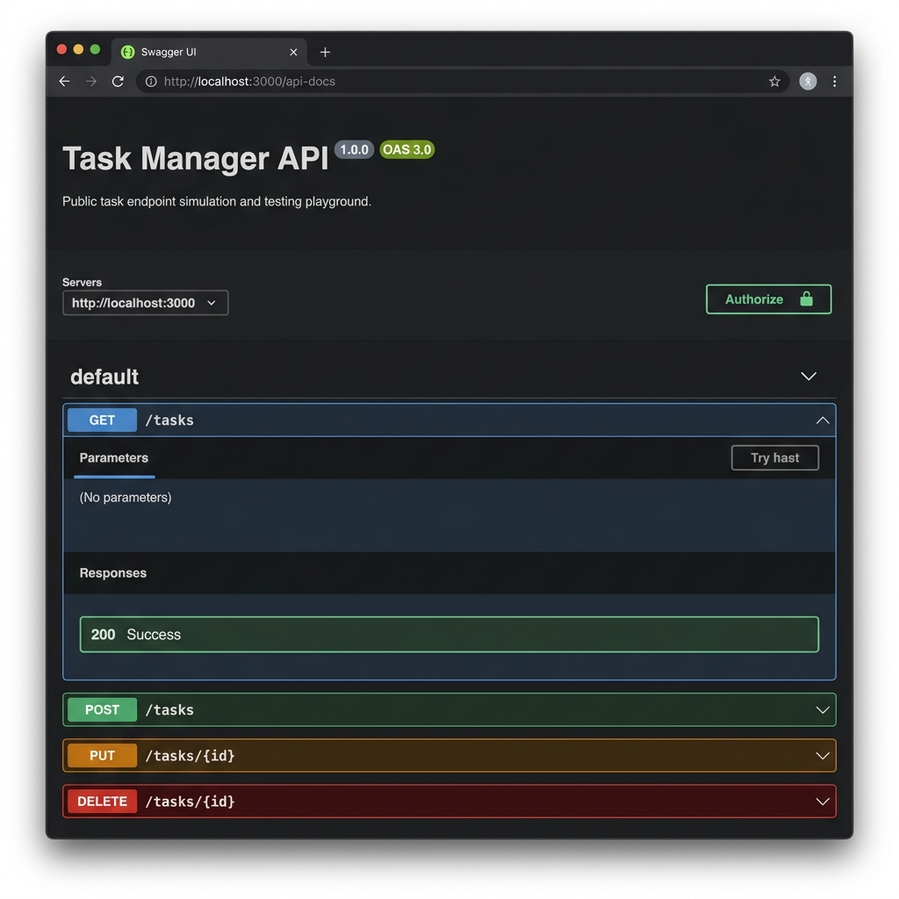

# Task Manager CRUD API

A lightweight RESTful CRUD API built with Express.js for managing tasks in-memory, featuring search & filtering capabilities and integrated Swagger documentation.

## Project Structure

- `src/`: Contains my manual modular implementation structured using the Controller-Service-Router pattern.
- `ai-version/`: Contains the AI-generated single-file implementation (`index.js` and `swagger.json`).

## How to Install & Run

Run the following command in your terminal to install dependencies and start the server:

```bash
npm install && npm start
```

The server starts at `http://localhost:3000`.

## API Endpoints

| Method | Endpoint | Description | Query / Request Body |
| :--- | :--- | :--- | :--- |
| `GET` | `/` | API Information | None |
| `GET` | `/health` | Health Check | None |
| `GET` | `/api-docs` | Swagger UI Interactive Docs | None |
| `GET` | `/tasks` | Get all tasks (supports filtering) | Query: `?done=true\|false`, `?search=keyword` |
| `GET` | `/tasks/:id` | Get task by ID | Path: `id` |
| `POST` | `/tasks` | Create a new task | Body: `{ "title": "Buy milk" }` |
| `PUT` | `/tasks/:id` | Update a task | Body: `{ "title": "Updated title", "done": true }` |
| `DELETE` | `/tasks/:id` | Delete a task by ID | Path: `id` |
| `GET` | `/stats` | Get task completion stats | None |

## Sample `curl -i` Output

```http
HTTP/1.1 200 OK
X-Powered-By: Express
Content-Type: application/json; charset=utf-8
Content-Length: 174
ETag: W/"ae-dG+T786G7y3/280gM2r0aM2r34"
Date: Fri, 07 Aug 2026 12:41:21 GMT
Connection: keep-alive

{
  "statusCode": 200,
  "data": [
    {
      "id": 1,
      "title": "Finish the project",
      "done": false
    },
    {
      "id": 2,
      "title": "Write documentation",
      "done": false
    },
    {
      "id": 3,
      "title": "Deploy to production",
      "done": false
    }
  ]
}
```

## Swagger Screenshot

Interactive API documentation is accessible at `http://localhost:3000/api-docs`.



## AI vs Me

### Prompt Used
> "So your job is to create a very simple task manager crud api with express js (javascript). You will do the whole coding in a signle file index.js, and you will not use any kinds of database so the tasks here actually lives on a variable and upon restarting the server they will be gone (which is totally fine). So you will create 3 basic task object inside an array with id, name and done (boolen) status, (all tasks will follow this formula). Then you will create get all tasks, get single task, post task, edit task (put) and delete task. And you will provide consistent structeral responses for both success and error. Look for some edge cases when handling errors. Also you might add some searching or filtering. Always send valid status codes in response. Create a swagger ui json file for me to test the api's inside the same folder. Do not over complicate the code and make it a mess, this is a really simple job,"

### Questions & Answers

#### What did the AI do better — and do you understand its version well enough to explain it?
**Answer:** I used Gemini 3.6 Flash. One thing it actually did better than me was showing consistent error/success messages with pre-defined functions and adding a global error handler. Also, it checked more edge cases for error handling than I had thought of.

#### What did it get wrong or quietly ignore from your prompt? (A missing 400 ? A wrong status code? A database you never asked for?)
**Answer:** It didn't get anything wrong quietly. I tried to give it clear and thorough context through my prompt.

#### What did your prompt forget to specify — and what did the AI silently decide for you?
**Answer:** Nothing much. As I mentioned, I tried to provide proper context so there wasn't much of a gap. However, the thing the AI did without me explicitly asking was handling global errors and creating separate reusable functions for sending responses, which was honestly a great addition.

